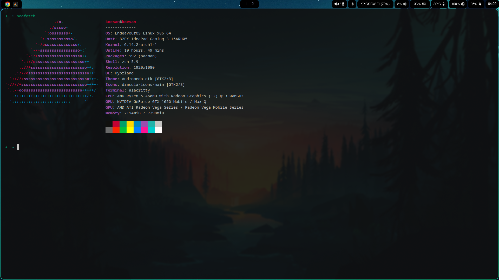
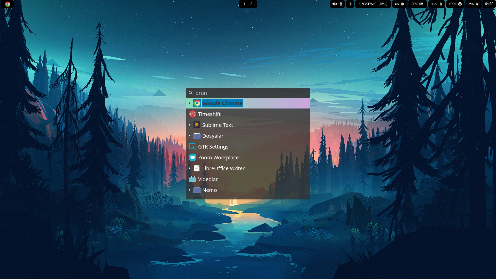
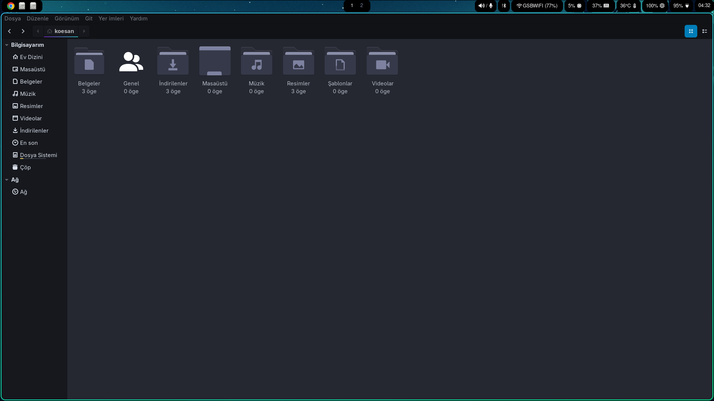

# Arch Linux Kurulum Rehberi

|  |  |
| --------------------------------------------------------------- | --------------------------------------------------------------- |
|  |  |


Bu rehberde, **Arch Linux** kurulumu ve yapılandırması için adımlar sırasıyla verilmiştir. Ayrıca bazı popüler uygulamaların kurulumları da yer almaktadır.

Bu kurulum **Arch Linux**'a özgüdür ve kullandığım Arch dağıtımı **EndeavourOS**'tur. EndeavourOS kurulumu hakkında internette birçok kaynak bulunmaktadır. Ancak, bu kurulum **diğer Arch tabanlı dağıtımlarda** da uygulanabilir. **Fedora**, **Debian** veya diğer dağıtımlarda bu kurulum test edilmemiştir, bu yüzden bu tür sistemlerde çalışıp çalışmayacağı garanti edilemez. Bu tür dağıtımlarda çalışmak için bazı ayarlamalar ve farklı paket yönetimi komutları gerekebilir.

**Uyarı**: Arch ve Arch tabanlı dağıtımlar, genellikle ileri düzey kullanıcılar için tasarlanmıştır. Yani bu kurulum sırasında karşılaşılan sorunlar, çözülmesi biraz daha fazla bilgi ve deneyim gerektirebilir. Başlamadan önce, sisteminizin yedeğini almanızı ve yeterli teknik bilgiye sahip olduğunuzdan emin olmanızı öneririm.

## Çekirdek ve Masaüstü Ortamı

Daha önceki Arch dağıtımlarında yaşadığım sorunlar ve deneyimlerim nedeniyle, sistemimde **2. bir çekirdek** ve **2. bir masaüstü ortamı** bulunduruyorum. Genel olarak **Zen çekirdeği** ve **GNOME masaüstü ortamı** tercih ediyorum. Ancak, farklı çekirdekler ve masaüstü ortamları kullanmanız da mümkündür. Kendi kullanım ihtiyaçlarınıza göre **Linux çekirdekleri** ve **masaüstü ortamları** arasında değişiklik yaparak, sisteminizi daha verimli hale getirebilirsiniz.

Bu, tamamen kişisel tercihlere ve kullanım senaryolarına bağlıdır, ve sisteminizin farklı konfigürasyonlarla nasıl çalıştığını test etmek de faydalı olabilir.

## Notlar:

> [!NOTE] **Config dosyaları için uyarı:**  
> Eğer config dosyalarınızda `.txt` uzantısı varsa, **.txt** ibaresini kaldırın. Dosya ismi yalnızca **config** olmalıdır.

> [!TIP] **Hazır Script Kullanımına Dair Uyarı:**  
> Bu repoda **hazır bir kurulum scripti** sunmamamın nedeni, internet üzerinde çok sayıda hazır dotfile kurulum scripti bulunduğundan dolayı bunların çoğu genel bir kurulum sağlar. Ancak bu tür scriptler, istediğiniz özelleştirmeleri yapmanıza genellikle olanak tanımaz ve bazen istemediğiniz ya da gereksiz gördüğünüz uygulamalar da kurulabilir.  
>   
> Bu yüzden adım adım kurulumu tercih ettim. Bu yöntemle, her aşamada istediğiniz kurulumu yapabilir, örneğin: **wofi yerine rofi** kullanabilir, **kendi terminal emilatörünüzü** veya **dosya yöneticinizi** seçebilirsiniz. Bu sayede daha özelleştirilmiş bir ortam elde edersiniz.

---

# KURULUM

## 0. Dosyaları Taşı

**dosya_tasi.sh** script'ini kullanarak dosyaları otomatik olarak taşıyabilirsiniz. Eğer bu script'i kullanmak istemiyorsanız, **dotfile** klasörü içerisindeki **alacritty**, **waybar**, **wlogout**, **wofi**, **hypr** klasörlerini **.config** klasörü içerisine taşıyın ve **.icons**, **.themes**, **.zshrc** dosya ve klasörlerini ise **home** dizinine taşıyın.

Aşağıdaki komutları kullanarak dosyalarınızı otomatik olarak taşıyabilirsiniz:

```bash
chmod +x dosya_tasi.sh
./dosya_tasi.sh
```

## 1. Sistemi Güncelle

Öncelikle, sisteminizi güncelleyerek en son paketleri almanız önemlidir.

```bash
sudo pacman -Syu
```

---

## 2. Timeshift Kurulumu

Sistem yedeği almak için Timeshift uygulamasını kurun.

```bash
sudo pacman -S timeshift
```

---

## 3. Yay (AUR Yardımcısı) Kurulumu

AUR'dan (Arch User Repository) paketleri yüklemek için yay (yay) aracını kurmanız gerekir.

Gerekli araçları yükleyin:

```bash
sudo pacman -S git base-devel
```

Yay’ı klonlayın ve kurun:

```bash
git clone https://aur.archlinux.org/yay.git
cd yay
makepkg -si
cd ..
rm -rf yay/
```

---

## 4. Google Chrome Kurulumu

Tarayıcı olarak Google Chrome'u AUR aracılığıyla yüklemek için aşağıdaki komutu kullanabilirsiniz. İsterseniz farklı bir tarayıcı da kurabilirsiniz.

```bash
yay -S google-chrome
```

---

## 5. Sublime Text Kurulumu

Sublime Text, popüler bir metin editörüdür. Kurulum için aşağıdaki kurulum yollarından birini çalıştırın:

### Pacman

```bash
curl -O https://download.sublimetext.com/sublimehq-pub.gpg && sudo pacman-key --add sublimehq-pub.gpg && sudo pacman-key --lsign-key 8A8F901A && rm sublimehq-pub.gpg

echo -e "\n[sublime-text]\nServer = https://download.sublimetext.com/arch/stable/x86_64" | sudo tee -a /etc/pacman.conf

sudo pacman -Syu sublime-text
```

### Aur

```bash
yay -S sublime-text-4
```

---

## 6. Zen Kernel Kurulumu

Çekirdekte bir sorun yaşanması durumunda alternatif bir çekirdeğe sahip olmak faydalı olabilir. Bu nedenle, Zen çekirdeğini mevcut çekirdeğin yanına kurabilirsiniz. Çekirdek seçimi, sistem başlatılırken GRUB ekranı üzerinden yapılabilir.

```bash
sudo pacman -S linux-zen linux-zen-headers
```

---

## 7. Hyprland Kurulumu (Wayland)

Hyprland'i ve gerekli bazı paketleri yükleyin.

```bash
sudo pacman -S hyprland hyprpaper grim slurp hyprpolkitagent
```

Ekran paylaşımı için gerekli paketleri yükleyin:

```bash
sudo pacman -S pipewire wireplumber
yay -S xdg-desktop-portal-hyprland-git
```

Hyprland'ı varsayılan yapmak için portals.conf dosyasını oluşturuyoruz:

```bash
mkdir -p ~/.config/xdg-desktop-portal
echo -e "[preferred]\ndefault=xdg-desktop-portal-hyprland" > ~/.config/xdg-desktop-portal/portals.conf
systemctl --user restart xdg-desktop-portal
```


Timeshift gibi uygulamaların düzgün çalışması için DBus çevre değişkenlerini güncelliyoruz (ilk çalıştırma yeterli):

```bash
dbus-update-activation-environment --systemd WAYLAND_DISPLAY XDG_CURRENT_DESKTOP XDG_SESSION_TYPE &
```

Her açılışta root'a yetki verilmesi için ~/.profile dosyasına ekliyoruz:

```bash
echo "xhost +SI:localuser:root" >> ~/.profile
```

### Gereksiz XDG portal paketlerini temizlemek için:

```bash
pacman -Q | grep xdg-desktop-portal-
sudo pacman -Rns xdg-desktop-portal-wlr
```

Fazladan masaüstü portal paketlerini temizlemek isterseniz aşağıdaki adımları izleyebilirsiniz.

```bash
pacman -Q | grep xdg-desktop-portal-
```

Çıktısı: 

```bash
xdg-desktop-portal-gnome 48.0-2
xdg-desktop-portal-gtk 1.15.3-1
xdg-desktop-portal-hyprland-git 1.3.9.r4.g150b0b6-1
```

Burada, ikinci masaüstü ortamınıza ait portal paketlerine, uyumsuzluk yaşanmaması için dokunmamalısınız. xdg-desktop-portal-hyprland-git Hyprland için gereklidir, ayrıca xdg-desktop-portal-gtk bazı uygulamalar için faydalı olabilir. Bunların dışındaki portal paketleri gereksizse kaldırabilirsiniz.

Gereksiz bir portal paketini kaldırmak için

```bash
sudo pacman -Rns xdg-desktop-portal-wlr
```

Bu kadar! Bu adımlarla Hyprland'ı varsayılan yapmış ve xhost yetkisini kalıcı hale getirmiş olduk. Sistemini yeniden başlattığında her şey çalışıyor olmalı.

---

## 8. Waybar Kurulumu

Waybar, Wayland tabanlı bir durum çubuğudur. Gerekli paketleri kurmak için.

```bash
sudo pacman -S waybar otf-font-awesome ttf-arimo-nerd noto-fonts xsensors pulseaudio blueman networkmanager btop
```

Giriş/çıkış ekranı için wlogout'u kurun:

```bash
yay -S wlogout
```

Bir uygulama başlatıcı ekleyin:

```bash
sudo pacman -S wofi
```

# veya

```bash
sudo pacman -S rofi
```

---

## 9. Nemo Dosya Yöneticisi Kurulumu

Nemo dosya yöneticisini yüklemek için:

```bash
sudo pacman -S nemo cinnamon-translations file-roller nemo-fileroller
```

---

## 10. Alacritty Terminal Kurulumu

Alacritty, hızlı bir terminal emülatörüdür.

```bash
sudo pacman -S alacritty
```

---

## 11. Zsh Kurulumu ve Yapılandırması

Zsh terminali, zengin özelliklere sahip bir kabuktur.

```bash
sudo pacman -S zsh
```
```bash
chsh -s $(which zsh)
```

Sistemi yeniden başlatın ve değişikliği kontrol etmek için.

```bash
echo $SHELL #bash yerine zsh çıktısı olamsı lazım bin/zsh gibi
```

# Gerekli araçlar

```bash
sudo pacman -S curl git wget
```

# Oh My Zsh ve eklenti kurulumu

```bash
sh -c "$(curl -fsSL https://raw.github.com/ohmyzsh/ohmyzsh/master/tools/install.sh)"
git clone https://github.com/zsh-users/zsh-autosuggestions.git $ZSH_CUSTOM/plugins/zsh-autosuggestions
git clone https://github.com/zsh-users/zsh-syntax-highlighting.git $ZSH_CUSTOM/plugins/zsh-syntax-highlighting
```

---

## 12. Python Kurulumu

Python ve pip'yi yükleyin:

```bash
sudo pacman -S python-pip python python-virtualenv

# pip hata çözümü
python3 -m pip config set global.break-system-packages true
```

---

## 13. Swap Alanı Oluşturma

8 GB'lık bir swap alanı oluşturmak için:

```bash
swapon --show
sudo swapoff -v /swapfile
sudo su
dd if=/dev/zero of=/swapfile bs=1024 count=8388608
chmod 600 /swapfile
mkswap /swapfile
swapon /swapfile
echo "/swapfile     swap     swap    defaults    0 0" >> /etc/fstab
```

---

## 14. Tema ve İkonlar

Görsel özelleştirme için Nwg-look aracını ve ikonları yükleyin:

```bash
sudo pacman -S nwg-look
# Temaları ve ikonları ~/.icons ve ~/.themes dizinlerine yerleştirin
```

Ardından, nwg-look programını çalıştırarak tema ve ikonları değiştirebilirsiniz.

---

Bu adımları takip ederek sisteminizi işlevsel, özelleştirilmiş ve güncel bir hale getirebilirsiniz. Arch Linux'un sunduğu esneklik sayesinde, kendi ihtiyaçlarınıza en uygun yapılandırmayı oluşturabilirsiniz. Unutmayın, bu süreç bazen zorlu olabilir, ancak elde edeceğiniz sonuçlar tamamen kişisel tercihleriniz doğrultusunda özelleştirilmiş güçlü bir sistem olacaktır.

Herhangi bir sorunla karşılaşırsanız, Arch topluluğu ve ilgili kaynaklar size yardımcı olmaktan mutluluk duyacaktır. Başarılar ve keyifli bir sistem deneyimi dilerim!
